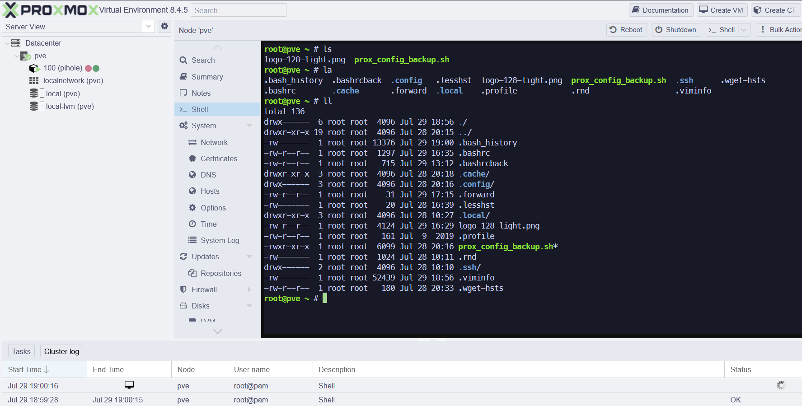
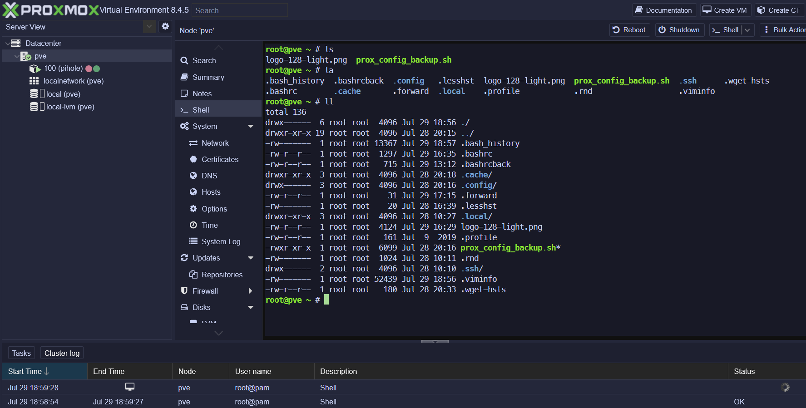

# 🎨 Proxmox Catppuccin Theme

Transform your Proxmox VE web interface with the soothing Catppuccin color palette. This theme automatically adapts between light (Latte) and dark (Mocha) variants based on your Proxmox theme settings.

> **Inspired by** [SolarPVE](https://github.com/dabeastnet/SolarPVE) - A Solarized-inspired theme for Proxmox VE

## ✨ What's Included

- **Automatic theme switching** - Seamlessly transitions between light and dark modes
- **Catppuccin color scheme** - Based on the popular Catppuccin palette
- **Zero JavaScript dependencies** - Pure CSS with minimal inline detection script
- **Easy installation** - Simple template modification

## 🚀 Quick Start

### Step 1: Deploy the CSS
```bash
# Copy the theme file to Proxmox's static assets
sudo cp catppuccin.css /usr/share/pve-manager/images/
```

### Step 2: Update the Template
Modify `/usr/share/pve-manager/index.html.tpl` by adding this before `</head>`:

```html
<script>
  document.addEventListener('DOMContentLoaded', () => {
    const darkLink = document.querySelector('link[href*="theme-proxmox-dark.css"]');
    if (darkLink) {
      document.body.classList.add('proxmox-theme-dark');
    }
  });
</script>
<link rel="stylesheet" href="/pve2/images/catppuccin.css">
```

### Step 3: Restart Services
```bash
sudo systemctl restart pveproxy
```

### Step 4: Clear Cache
Hard refresh your browser (Ctrl+F5) to see the changes.

## 🎯 How It Works

The theme uses CSS custom properties and a simple detection script:

- **Light Mode**: Default Catppuccin Latte colors when Proxmox uses light theme
- **Dark Mode**: Catppuccin Mocha colors when `theme-proxmox-dark.css` is detected

The detection script adds a `proxmox-theme-dark` class to the body element, allowing targeted dark-mode styling.

## 🎨 Customization

Edit the CSS variables in `catppuccin.css` to tweak colors:

```css
:root {
  --base00: #1e1e2e;  /* Dark background */
  --base01: #181825;  /* Lighter background */
  --accent: #cba6f7;  /* Accent color */
  /* ... more variables */
}
```

For dark-mode specific overrides:

```css
body.proxmox-theme-dark .your-element {
  /* Dark mode styles */
}
```

## 📸 Preview

### Light Theme (Catppuccin Latte)


### Dark Theme (Catppuccin Mocha)


## 🎨 Custom Logos

### Dark Theme Logo


### Light Theme Logo  


### Upload Custom Logo via SCP

To upload your custom logo to the Proxmox server:

```bash
# Upload dark theme logo
scp /path/to/your/logo-128-dark.png root@YOUR_SERVER_IP:/usr/share/pve-manager/images/

# Upload light theme logo  
scp /path/to/your/logo-128-light.png root@YOUR_SERVER_IP:/usr/share/pve-manager/images/

# Example (Windows PowerShell):
PS C:\Users\YOU\Desktop> scp C:\Users\YOU\Desktop\logo-128-dark.png root@192.253.1.103:/usr/share/pve-manager/images/

```

After uploading, restart the Proxmox service:
```bash
sudo systemctl restart pveproxy
```

### Troubleshooting Logo Issues

If the custom logo doesn't appear:

1. **Check file permissions:**
   ```bash
   sudo chmod 644 /usr/share/pve-manager/images/logo-128-*.png
   ```

2. **Clear browser cache** (Ctrl+F5 or Ctrl+Shift+R)

3. **Check browser developer tools** (F12) for any CSS conflicts

4. **Verify file exists:**
   ```bash
   ls -la /usr/share/pve-manager/images/logo-128-*.png
   ```

5. **Alternative: Replace default logo directly:**
   ```bash
   sudo cp /usr/share/pve-manager/images/logo-128-dark.png /usr/share/pve-manager/images/proxmox_logo.png
   ```

## 🤝 Contributing

Found a bug or want to improve something?

1. Fork the repository
2. Create your feature branch (`git checkout -b feature/amazing-thing`)
3. Commit your changes (`git commit -m 'Add amazing thing'`)
4. Push to the branch (`git push origin feature/amazing-thing`)
5. Open a Pull Request

## 📄 License

This project is licensed under **CC BY-NC 4.0**.

- ✅ Free for non-commercial use with attribution
- ❌ Commercial use requires separate licensing

---

## 📋 TODO

- [ ] Add custom Catppuccin-themed logo (`logo-128-dark.png`)
- [ ] Create light variant logo (`logo-128-light.png`)
- [ ] Update favicon references in template

---

**Enjoy your beautifully themed Proxmox interface!** 🌟


